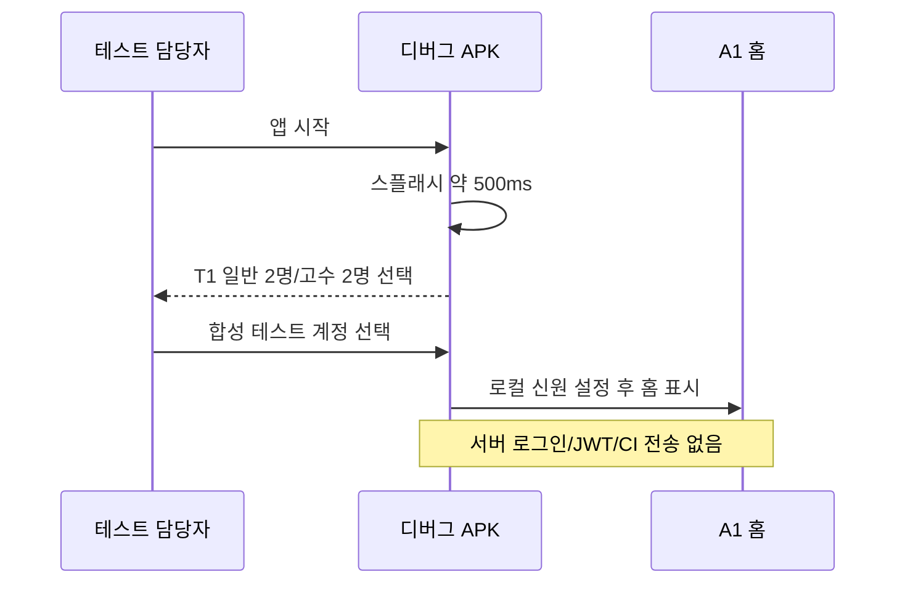
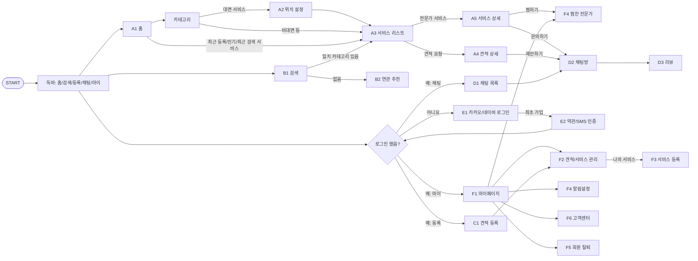
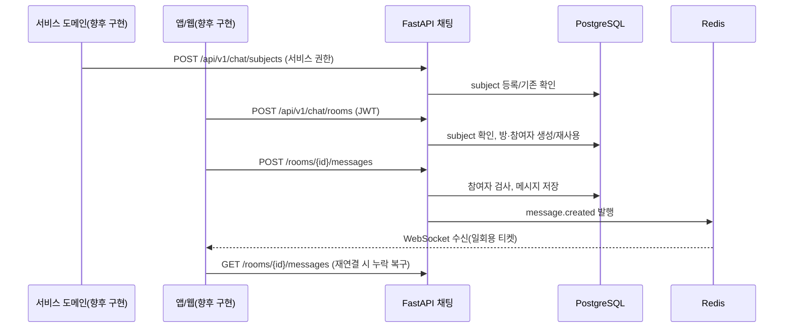
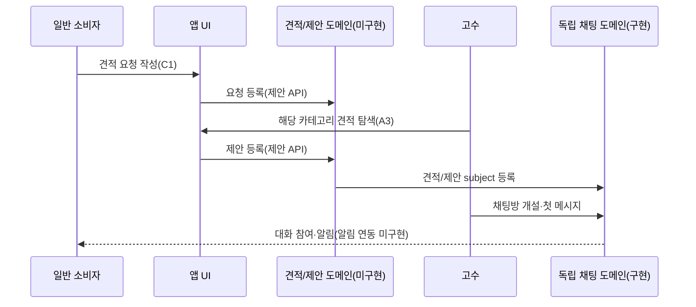

# 서비스순서도

기준일: 2026-09-27. 사용자가 제공한 `서비스순서도.png`의 **화면 이동 흐름**을 먼저 기록하고, 아래에 시스템 상호작용을 분리한다. 화면 간 화살표는 구현 완료나 업무 규칙 확정을 뜻하지 않는다.

## 전체 서비스 화면 흐름 — 제공된 순서도 근거, 일부 구현

2026-09-27 사용자 지시로 원본 순서도 앞에 `스플래시 S0 → 앱 내 500ms → 디버그 전용 T1 테스트 계정 선택 → 메인 T0/A1`을 추가했다. 릴리스 빌드는 T1을 건너뛴다. Android 디버그 APK에서 [스플래시](../previews/android-splash-view.png), [계정 선택](../previews/android-test-account.png), [홈](../previews/android-test-expert-home.png)을 확인했다. OS 콜드 스타트 시간은 500ms에 포함되지 않는다. 하단 독바는 원본 순서도의 홈·검색·등록·채팅·마이를 따른다. 홈 외의 탭과 상세 이동은 이번 APK에서 아직 연결하지 않았다.

원본은 `F4`를 **알림설정**과 **찜한 전문가**에 중복 표기한다. 위 그래프의 `F4` 두 노드는 같은 화면이라고 확정한 것이 아니다. [화면설계서](../planning/SCREEN-DESIGN.md)에서 임시 식별자로 구분하며, 원본 화면 ID 정정이 필요하다. 원본의 점선은 `문의하기/제안하기 → 채팅방`, `찜하기 → 찜한 전문가` 연결로 해석했다. 대면 서비스에 위치 설정이 붙는 점과 최초 가입에만 E2가 붙는 점은 그림에 명시되어 있다. `B2` 추천 이후의 목적지, 로그인 후 원래 행동으로 돌아가는 정확한 방식, 리뷰 자격 조건은 그림에 표시되지 않았다.

### 화면 이동 요약

| 시작 | 조건/행동 | 도착 | 근거 상태 |
|---|---|---|---|
| 홈 A1 | 카테고리 선택, 대면 서비스 | 위치 설정 A2 → 리스트 A3 | 순서도 명시 |
| 홈 A1 | 최근 등록·비대면 인기·최근 검색 서비스 선택 | 서비스 탐색/상세 | 순서도 연결. 세부 목적지는 원본 재확인 필요 |
| 검색 B1 | 일치 카테고리 있음/없음 | 리스트 A3 / 연관 추천 B2 | 순서도 명시 |
| 리스트 A3 | 전문가 서비스/견적 요청 선택 | 서비스 상세 A5 / 견적 상세 A4 | 순서도 명시 |
| 상세 A5/A4 | 문의하기/제안하기 | 채팅방 D2 | 점선 연결, 서버 연동 미구현 |
| 등록·채팅·마이 탭 | 미로그인 | E1 로그인, 최초 가입은 E2 약관·SMS | 순서도 명시 |
| 채팅 목록 D1 | 방 선택 | 채팅방 D2 → 리뷰 D3 | 순서도 명시, 리뷰 조건 미결정 |
| 마이 F1 | 관리/찜/알림/고객센터/탈퇴 | F2, F4(찜), F4(알림), F6, F5 | 순서도 명시, F4 중복 |

## 시스템 상호작용 — 현재 구현과 계획 구분

## 채팅방 생성과 메시지 전달 — 채팅 인프라 구현

## 소비자 견적 요청 → 고수 제안 — 화면 근거 기반 제안, 미구현

제안 자격, 제안 데이터·수락, 거래 확정 및 리뷰 순서는 [미결정 사항](../planning/DECISIONS.md) Q03–Q05가 정해진 뒤 상세화한다.
