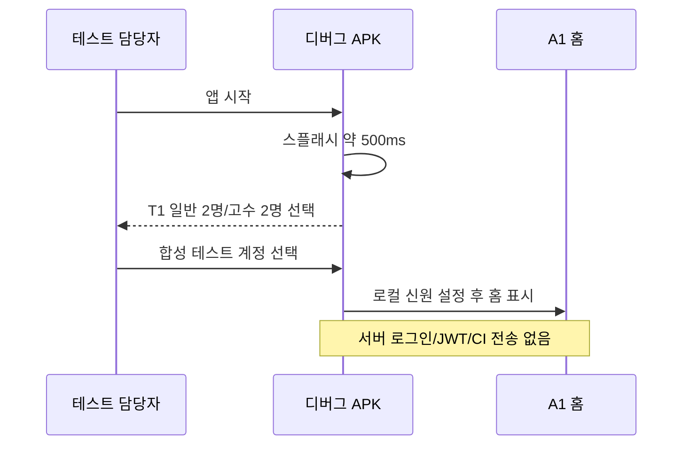
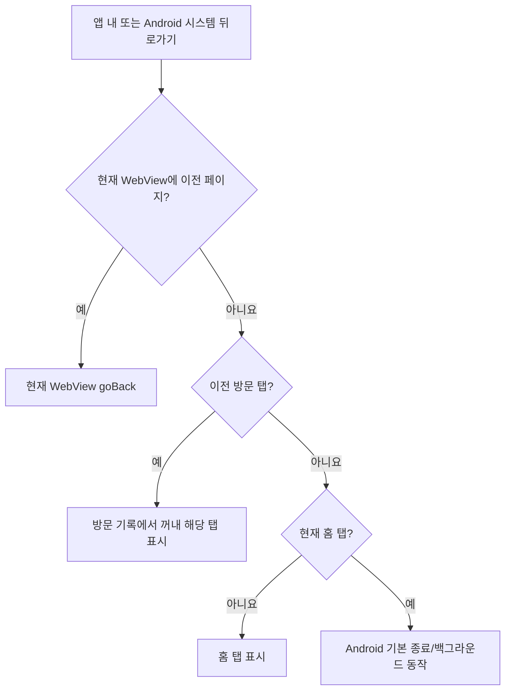
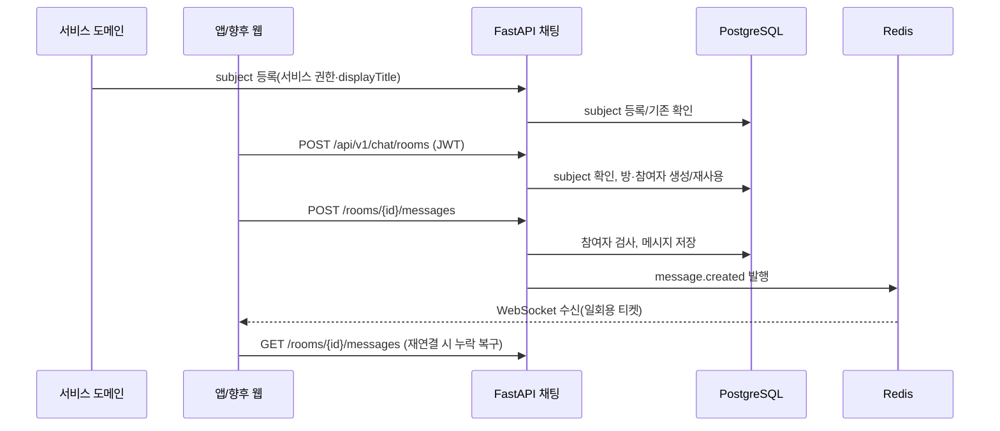
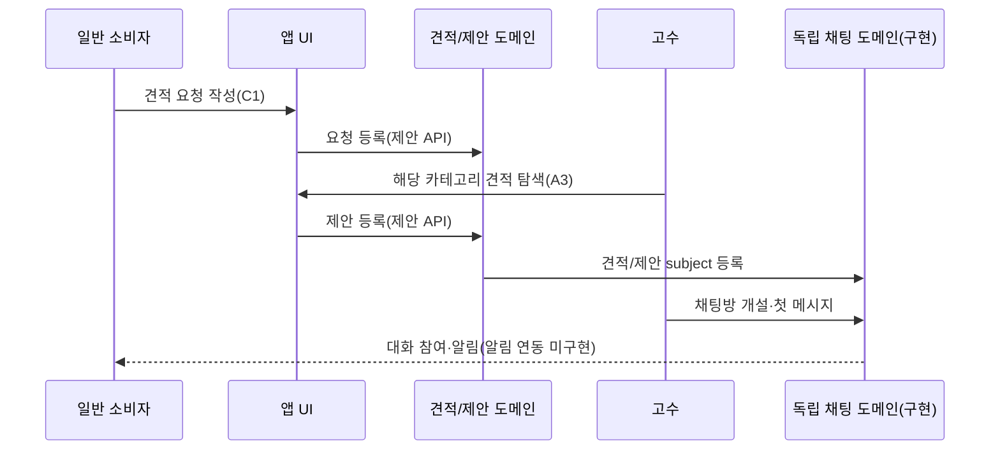
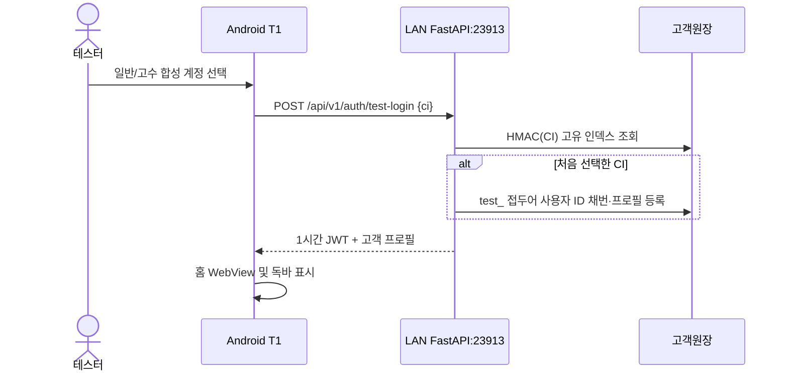
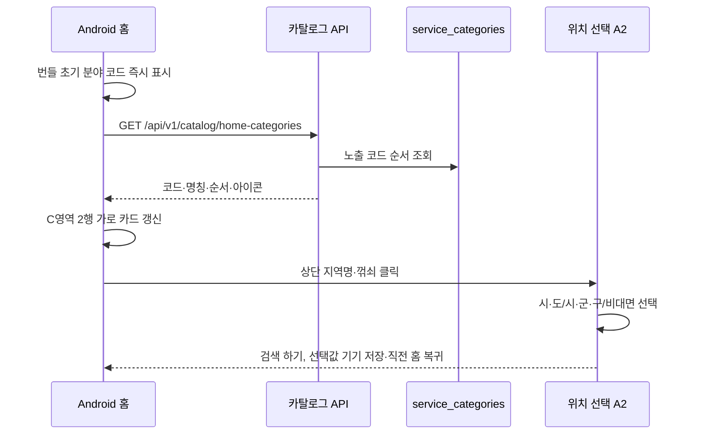
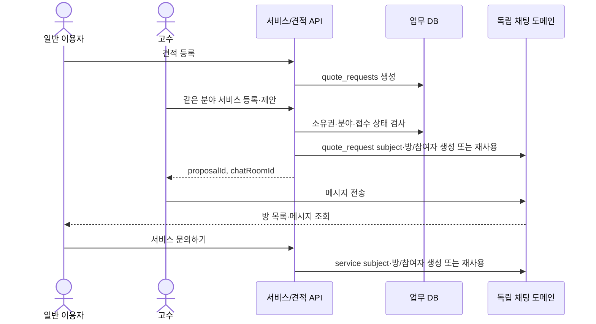
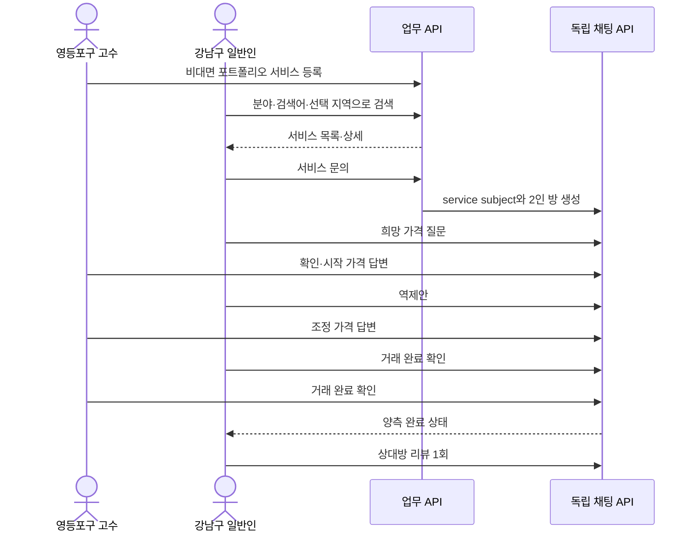

# 서비스순서도

기준일: 2026-09-28. 사용자가 제공한 `서비스순서도.png`의 **화면 이동 흐름**을 먼저 기록하고, 아래에 시스템 상호작용을 분리한다. 화면 간 화살표는 구현 완료나 업무 규칙 확정을 뜻하지 않는다.

## 전체 서비스 화면 흐름 — 제공된 순서도 근거, 일부 구현

2026-09-27 사용자 지시로 원본 순서도 앞에 `스플래시 S0 → 앱 내 500ms → 디버그 전용 T1 테스트 계정 선택 → 메인 T0/A1`을 추가했다. 릴리스 빌드는 T1을 건너뛴다. Android 디버그 APK에서 [스플래시](../previews/android-splash-view.png), [계정 선택](../previews/android-test-account.png), [홈](../previews/android-test-expert-home.png)을 확인했다. OS 콜드 스타트 시간은 500ms에 포함되지 않는다. 하단 독바는 원본 순서도의 홈·검색·등록·채팅·마이를 따른다. 홈 외의 탭과 상세 이동은 이번 APK에서 아직 연결하지 않았다.

원본은 `F4`를 **알림설정**과 **찜한 전문가**에 중복 표기한다. 위 그래프의 `F4` 두 노드는 같은 화면이라고 확정한 것이 아니다. [화면설계서](../planning/SCREEN-DESIGN.md)에서 임시 식별자로 구분하며, 원본 화면 ID 정정이 필요하다. 원본의 점선은 `문의하기/제안하기 → 채팅방`, `찜하기 → 찜한 전문가` 연결로 해석했다. 대면 서비스에 위치 설정이 붙는 점과 최초 가입에만 E2가 붙는 점은 그림에 명시되어 있다. `B2` 추천 이후의 목적지, 로그인 후 원래 행동으로 돌아가는 정확한 방식, 리뷰 자격 조건은 그림에 표시되지 않았다.

### 화면 이동 요약

| 시작 | 조건/행동 | 도착 | 근거 상태 |
|---|---|---|---|
| 홈 A1 | 카테고리 선택, 대면 서비스 | 위치 설정 A2 → 리스트 A3 | 순서도 명시 |
| 홈 A1 | 최근 등록·비대면 인기·최근 검색 서비스 선택 | 서비스 탐색/상세 | 순서도 연결. 세부 목적지는 원본 재확인 필요 |
| 검색 B1 | 일치 카테고리 있음/없음 | 리스트 A3 / 연관 추천 B2 | 순서도 명시 |
| 리스트 A3 | 전문가 서비스/견적 요청 선택 | 서비스 상세 A5 / 견적 상세 A4 | 순서도 명시 |
| 상세 A5/A4 | 문의하기/제안하기 | 채팅방 D2 | 업무 API가 독립 subject/방에 연결. D2의 사진·문서 첨부 UI 구현 |
| 등록·채팅·마이 탭 | 미로그인 | E1 로그인, 최초 가입은 E2 약관·SMS | 순서도 명시 |
| 채팅 목록 D1 | 연결된 서비스/견적 제목과 읽지 않은 수를 보며 방 선택; 다음 20개가 있으면 더 보기 | 채팅방 D2 → 양측 완료 확인 후 리뷰 D3 | 목록 커서와 제목 스냅샷 구현, 실제 휴대폰 UI 검증 전 |
| 채팅방 D2 | `＋` → 시스템 사진·문서 선택 → 업로드 → 메시지 전송 → 첨부 누름 → 시스템 저장 위치 선택 | 같은 독립 방의 참가자만 파일 원본 다운로드 | Android 문서 전송 에뮬레이터 확인, 두 휴대폰 검증 전 |
| 마이 F1 | 관리/찜/알림/고객센터/탈퇴 | F2, F4(찜), F4(알림), F6, F5 | 순서도 명시, F4 중복 |

## 시스템 상호작용 — 현재 구현과 계획 구분

## 5개 독립 WebView와 뒤로가기 — 구현

사용자 확정 요구 R-015에 따라 홈·검색·등록·채팅·마이는 각각 별도 WebView를 가진다. 탭을 바꿔도 각 WebView의 현재 페이지·스크롤·방문 기록을 유지한다. 앱 화면에 뒤로가기 버튼이 있는 경우와 Android 시스템 뒤로가기 버튼/제스처는 **같은 뒤로가기 처리 함수**를 호출한다.

현재 탭 WebView 안에 이전 페이지가 있으면 먼저 그 페이지로 돌아간다. 탭의 시작 페이지라면 최근 방문한 다른 탭으로 돌아가되, 탭 복귀 기록은 되돌아간 항목을 제거해 두 탭 사이를 왕복하지 않도록 한다. 복귀할 탭도 없고 홈이 아닌 경우 홈으로 이동한다. 홈의 시작 페이지에서 더 돌아갈 곳이 없으면 앱을 종료한다. 디버그 테스트 계정 선택 화면은 이 뒤로가기 경로에 끼워 넣지 않는다. 에뮬레이터에서 기본 동작을 확인했으며 두 실기기의 시스템 제스처·탭 왕복 조합은 추가 검증이 필요하다.

## 채팅방 생성과 메시지 전달 — 채팅 인프라 구현

## 소비자 견적 요청 → 고수 제안 — 핵심 경로 구현

제안 자격, 제안 데이터·수락, 거래 확정 및 리뷰 순서는 [미결정 사항](../planning/DECISIONS.md) Q03–Q05가 정해진 뒤 상세화한다.

## 디버그 테스트 로그인 — 구현

로그인 실패 시 T1으로 돌아간다. 동일 CI 재로그인은 기존 사용자 ID를 재사용한다. 앱의 마이 화면은 서버 응답의 이름·ID·생년월일·주소를 표시한다. 실제 Kakao/Naver 검증은 아직 없다.

## 5개 WebView 내비게이션 — 구현

탭을 처음 선택할 때 해당 WebView를 만들고, 탭 이동 시 파괴하지 않는다. 뒤로가기는 활성 WebView의 상세 방문 기록 → 직전 탭 → 홈 → 앱 종료 순서다. HTML 뒤로가기와 Android 시스템 뒤로가기는 같은 처리 함수를 호출한다.

## 홈 분야 코드·지역 선택 — 구현 범위

지역 선택은 기기에 저장되고 서비스/견적 목록 API의 `regions`, `includeRemote` 필터로 전달된다. Android 뒤로가기로 A2를 닫으면 변경을 저장하지 않는다.

C영역의 2행 좌우 스와이프는 R-022에 따라 빌드·에뮬레이터 홈 화면에서 확인했다. 카테고리 API의 응답 순서와 값은 변경하지 않는다.

## 서비스·견적·채팅 연결 — 격리 테스트 통과

작성자 본인 문의, 다른 분야 서비스로 제안, 마감 견적 제안은 거부한다. 두 사용자 역할 화면은 하나의 Android 앱 안에서 전환한다. 결제·정산은 이번 범위에서 제외했다.

## 강남구 일반인 ↔ 영등포구 고수 검색·협상·리뷰

서비스·견적은 작성자가 언제든 수정·논리 삭제할 수 있다. 삭제 뒤 공개 목록·상세에서는 사라지지만 기존 채팅방·메시지·완료 확인·리뷰는 보존한다. 2026-09-27~28 실행한 1,000회 교차 지역 시나리오 결과는 [테스트 보고서](../test-results/cross-district-1000-20260927.md)를 따른다.
# 고객센터 F6

일반/고수 마이 → 고객센터 → 본인 JWT로 접수 내역 조회 → 제목·내용 작성 → API가 고객원장 사용자 ID를 요청자로 저장 → 본인 내역에 새 문의 표시. 다른 계정의 목록에는 표시하지 않고 직접 상세 ID 조회도 404를 반환한다. 운영자 답변·상태 변경은 관리자 권한 정책 확정 후 연결한다.

## 앱 내 알림

채팅 메시지·견적 제안·리뷰·서비스 문의 저장 → 같은 DB 트랜잭션에서 상대 계정의 알림 1건 저장 → 홈 종 또는 마이 알림에서 본인 JWT로 최근순 목록 조회 → 항목을 누르면 본인 알림 읽음 기록 → 연결된 채팅방 이동. 동일 메시지 재전송과 기존 문의방/제안 재시도는 새로운 알림을 만들지 않는다. OS 푸시 전송은 후속 별도 경계다.
