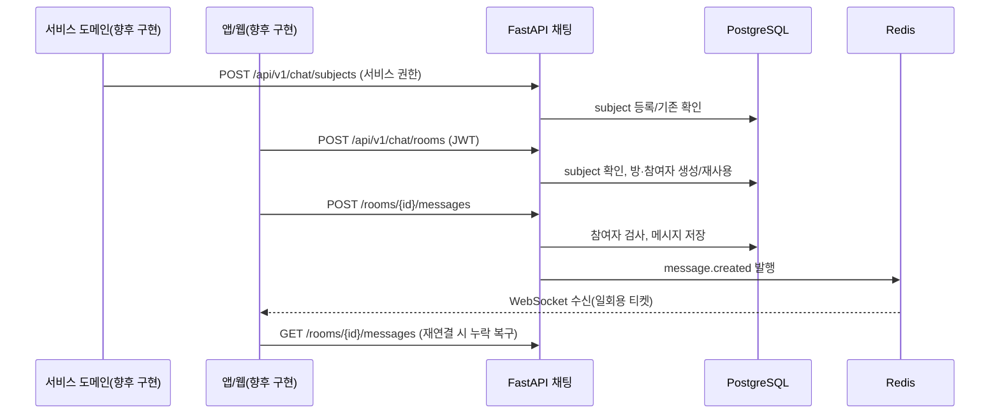
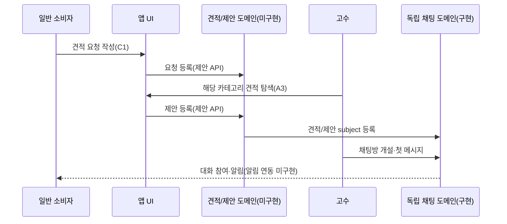

# 서비스순서도

기준일: 2026-09-27. `구현` 흐름과 `제안` 흐름을 분리한다. 미구현 업무 API를 현재 서비스에서 사용할 수 있다는 뜻이 아니다.

## 채팅방 생성과 메시지 전달 — 채팅 인프라 구현

## 소비자 견적 요청 → 고수 제안 — 화면 근거 기반 제안, 미구현

제안 자격, 제안 데이터·수락, 거래 확정 및 리뷰 순서는 [미결정 사항](../planning/DECISIONS.md) Q03–Q05가 정해진 뒤 상세화한다.
